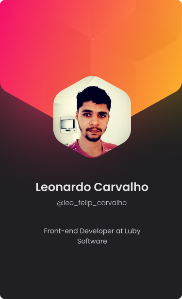

# Leonardo Carvalho
Front-end developer

Meu nome é Leonardo Carvalho, sou graduando em Análise e Desenvolvimento de Sistemas e estou em busca de novas oportunidades como Desenvolvedor Front-end Júnior.

Tenho experiência no desenvolvimento de aplicações web usando JavaScript, React JS e TypeScript, e também estou familiarizado com diversas tecnologias de ecossistemas como Jira, GitHub e Figma. Eu também tenho alguma experiência com desenvolvimento móvel.

## 🛠 &nbsp;Tech Stack

<!--
- 📍 From RR living in Boa Vista
- 🧑🏽‍💻 Junior Front-end Developer
- 👨‍🎓 Graduating systems analysis and development
- 🔭 I’m currently looking for new opportunities
- 🤓 Looking for opportunities to acquire and share knowledge

 

## ⚙️ &nbsp;GitHub Analytics

